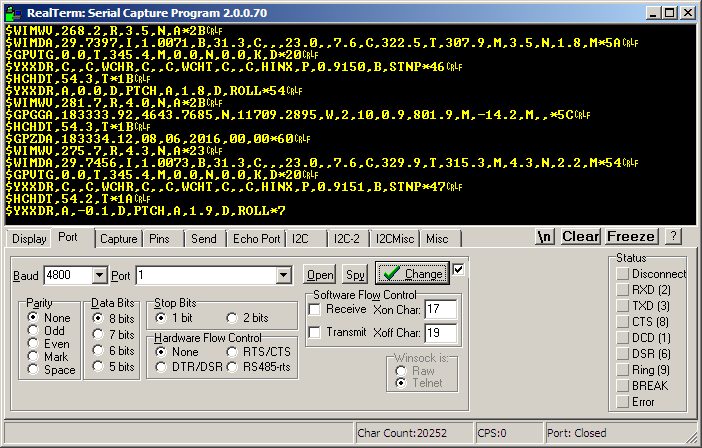
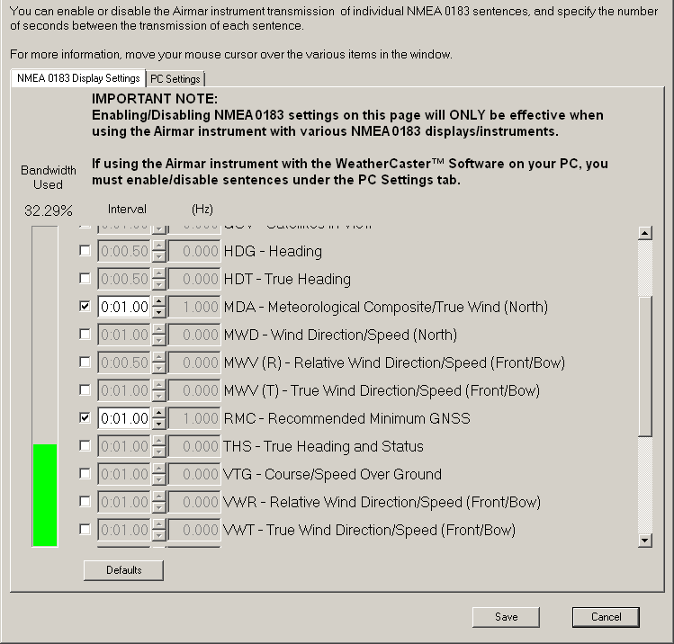

Landfill Met Tower
==================

Lewiston-Clarkston Valley Formaldehyde Study (2016)
---------------------------------------------------

Documentation for the meterogological tower at the Asotin landfill. The tower
has a compact weather station ([150WX; Airmar][150wx]) mounted at 33ft (10m)
and a temperature/relative humidity probe ([CS215; Campbell Scientific][cs215])
mounted at 6ft (1.9m). Data is recorded with a micrologger ([CR1000; Campbell
Scientific][cr1k]) and stored to CompactFlash media. Scalars recorded include:

* approx. 1 Hertz (raw data stream from weather station), at 10m height:
    * air temperature
    * barometeric pressure
    * relative humidity
    * wind direction
    * wind speed
    * *location data from GPS?*
* at 1 minute, at 2m height:
    * air temperature
    * relative humidity
* 30-min mean & standard deviation of:
    * *everything*

A broadband modem provides the datalogger with a stable time reference source;
it also allows remote monitoring and automatic data collection.

The tower ([UT30; Campbell Scientific][ut30]) is guyed at one (or two) levels
with 1/8" wire rope to driven earth anchors ([DUCKBILL 88; Foresight Products).

  [150wx]: http://www.airmartechnology.com/productdescription.html?id=155
  [cs215]: http://www.campbellsci.com/cs215-l
  [cr1k]: http://www.campbellsci.com/cr1000
  [ut-30]: http://www.campbellsci.com/ut30
  [duck88]: http://www.earthanchor.com/duckbill/what-is-duckbill/models/

### Quick Start

1. Connect things
    a. Power input (120VAC line source or 16-28VDC solar panel) **to** 
       battery-backed 12VDC regulator in enclosure
    b. *If using solar power:* external 12V deep-cycle battery **to(( 12VDC
       regulator's auxilary battery terminal
    c. Weather station data cable **to** RS422/RS232 converter data terminal
       and 12VDC supply from datalogger
    d. Antenna **to** broadband modem
2. Turn things on using ON/OFF switch of the battery-backed 12V regulator
3. Validate operation by
    a. Attaching keyboard display to CSI/O port
    b. Navigating to <http://the.modem.ip.address> (and possibly entering
       HTTP password)
    c. (FUTURE:) Connect using Bluetooth and review data using 
       [LoggerLink][https://www.campbellsci.com/loggerlink]

### Initial Device Setup

Step-by-step instructions are available in the relevant user manuals. See
[References](#references) below.

#### Weather Station (150WX)

Use [Airmar WeatherCaster](http://www.airmartechnology.com/software-downloads.html)
to disable all NMEA0183 sentences *except* `WIMDA` and `GPRMC`. Keep the
default 1Hz (`0:01.00`) interval.

> Eliminating unnecessary sentences will make parsing the interleaved data
> stream **much** easier.

Using factory defaults, the 150WX produces a lot of data:

Update the configuration as shown here:

After power cycling, the new configuration persists:

Once the GPS has signal lock, the data stream looks like this:

#### Temperature/Relative Humidity Probe (CS215)

This devices does not require any configuration before use.

#### Datalogger (CR1000)

Use [Device Configuration Utility](https://www.campbellsci.com/devconfig) to
secure the datalogger (since it will be Public):

* Disable Telnet
* Disable FTP
* Enable/set a Level 1 or higher security code
* Enable/set a PakBus encryption key
* Eanble/set a PakBus/TCP password
* (FUTURE?) Enable/set an HTTP password (.csipasswd)

#### Broadband Modem (Raven X)

Login to the device's web interface (typ. <http://192.168.13.31:9191> from the
LAN side) and set the following configuration (on factory defaults):

* LAN > Ethernet
    * Host Public Mode: Ethernet Uses Public IP
* LAN > Global DNS (optional, recommended)
    * Alternate Primary DNS: *<WSU primary nameserver IP address>*
    * Alternate Secondary DNS: *<WSU secondary nameserver IP address>*
* Services > ACEManager (optional, strongly recommended for emergency remote
  administration)
    * OTA ACEmanager Access: SSL Only
* Services > Telnet/SSH
    * AT Server Mode: SSH
    * [Make SSH Keys] button: Press if SSH is not initalized 
* Services > Time (SNTP)
    * Enable time update: Enabled
    * SNTP Server Address: *[pick one](http://support.ntp.org/servers)*

Apply and reboot.

### References <a name="references"/>

* Campbell Scientific, Inc. *CR1000 Measurement and Control System Operator's
  Manual.* Revision 2015 Apr 13. 
  Online: <https://s.campbellsci.com/documents/us/manuals/cr1000.pdf>

* Campbell Scientific, Inc. *CS215 Temperature and Relative Humidity Probe
  Instruction Manual.* Revision 2016 Apr.
  Online: <https://s.campbellsci.com/documents/us/manuals/cs215.pdf>

* Airmar Technology Corp. *PB100 WeatherStation Technical Manual.* Revision 1.007.
  Online: <http://www.airmartechnology.com/uploads/installguide/PB100TechnicalManual_rev1.007.pdf>

* Airmar Technology Corp. *Ultrasonic WeatherStation Instrument Owner's Guide &
  Installation Instructions.* Revision 2016 Jan 28.
  Online: <http://airmartechnology.com/uploads/InstallGuide/17-461-01.pdf>

