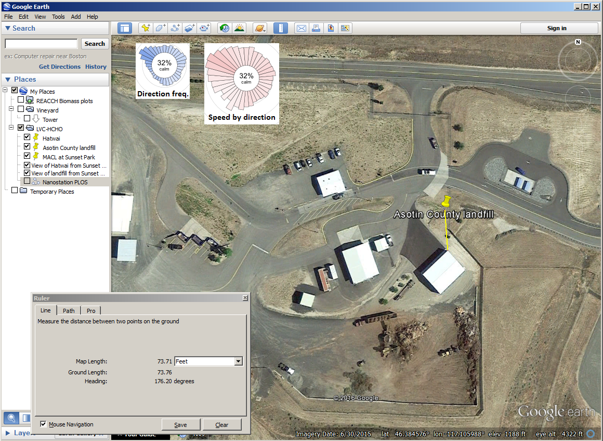
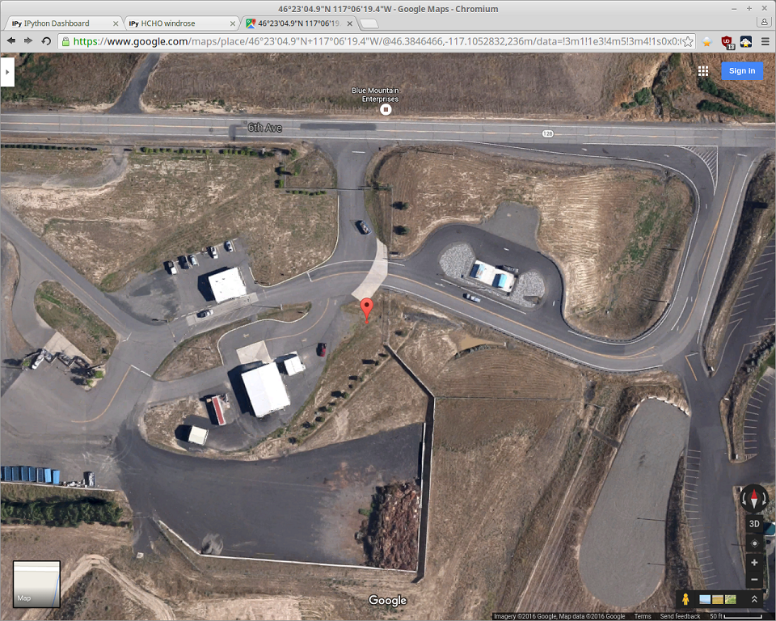
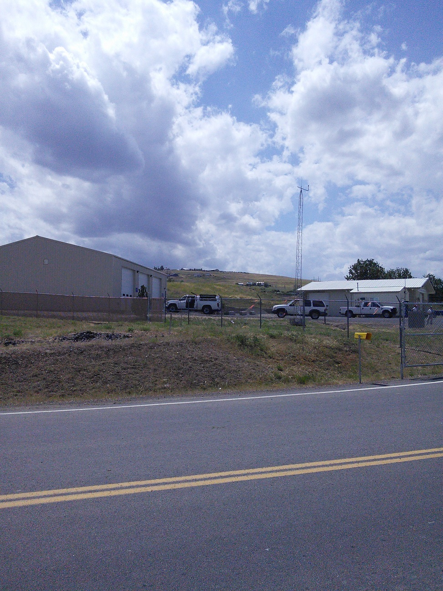
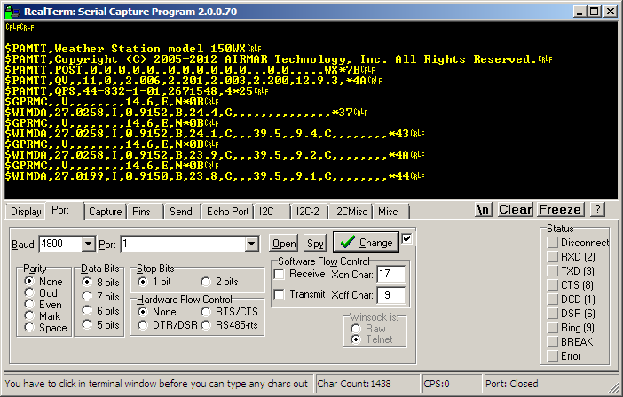
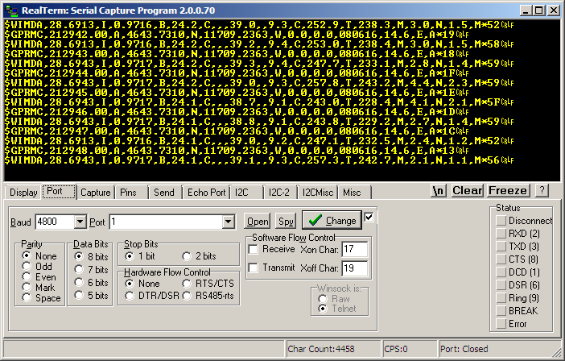

Landfill Met Tower
==================

Lewiston-Clarkston Valley Formaldehyde Study (2016-2017)
--------------------------------------------------------

Documentation for the meterogological tower at the Asotin landfill. This tower
provides local weather conditions in the up-river portion of the LC Valley.
Measurements include:

* At 33ft (10m), via ultrasonic weather station ([150WX; Airmar Technologies][150wx])
    * Temperature
    * Relative humidity
    * Dewpoint
    * Barometric pressure
    * Wind speed
    * Wind direction
    * Location (GPS)
* At 6.5ft (2m), via digital T/RH probe ([CS215; Campbell Scientific][cs215])
  in double-louvered radiation shield
    * Temperature
    * Relative humidity

A programmable datalogger ([CR1000; Campbell Scientific][cr1k]) acquires and
stores data to CompactFlash media. Raw measurements are aggregated into 1-min
and 30-min values. Data is automatically retrieved several times daily by a
computer in the Mobile Air Chemistry Laboratory for consumption by researchers.

A broadband modem provides internet connectivity to facilite remote operation,
including automatic data collection, and provide the datalogger with a stable
time source (NTP). Communications are encrypted and services are password
protected.

The tower ([UT30; Campbell Scientific][ut30]) is anchored to a weighted
shipping pallet and guyed at mid-level with 1/8" wire rope to driven earth
anchors ([DUCKBILL 88; Foresight Products][duck88]).

  [150wx]: http://www.airmartechnology.com/productdescription.html?id=155
  [cs215]: http://www.campbellsci.com/cs215-l
  [cr1k]: http://www.campbellsci.com/cr1000
  [ut30]: http://www.campbellsci.com/ut30
  [duck88]: http://www.earthanchor.com/duckbill/what-is-duckbill/models/


### Quick Start

1. Connect things
    * Power input (120VAC line source or 16-28VDC 20W solar panel) **to** 
      battery-backed 12VDC regulator in enclosure
    * *If using solar power:* external 12V deep-cycle battery **to** 12VDC
      regulator's auxilary battery terminal
    * Weather station data cable **to** RS422/RS232 converter data terminal
      *and* 12VDC supply from datalogger
    * Antenna **to** broadband modem
2. Turn things on using ON/OFF switch of the battery-backed 12V regulator
3. Validate operation by
    * Attaching keyboard display to CSI/O port
    * Navigating to `http://the.modem.ip.address` (and possibly entering
      HTTP password)
    * (FUTURE:) Connect using Bluetooth and review data using 
      [LoggerLink][https://www.campbellsci.com/loggerlink]


### Data Products

Data files are in the "TOA5" format (Campbell Scientific), a multi-header
comma-separated values file. If you use the excellent
[pandas](http://pandas.pydata.org) Python library, try this:

```python
import pandas as pd

df = pd.read_csv('/path/to/data/file.dat',
                 index_col=0, # timestamps in first column
                 parse_dates=True, # iso8601
                 header=1, # 1st line metadata 2nd headers
                 skiprows=[2,3], # 3rd units 4th agg type
                 # Table 129 (p484) in CR1000 manual rev. 4/13/15
                 # https://s.campbellsci.com/documents/us/manuals/cr1000.pdf
                 na_values=['NAN', -7999, 7999], keep_default_na=False)
```

#### Plotting Examples

See these two Jupyter notebooks (rendered via nbviewer):

* [Example Windrose plots](http://nbviewer.jupyter.org/urls/bitbucket.org/wsular/2016-hcho-landfill-met-tower/raw/writeup/data/Example%20windrose%20plots.ipynb)
* [Example Bokeh plots](http://nbviewer.jupyter.org/urls/bitbucket.org/wsular/2016-hcho-landfill-met-tower/raw/writeup/data/Example%20Bokeh%20plots.ipynb)

#### Table files: `*_halfhourly.dat`

Primary data product.

* Table name: halfhourly
* Record interval: 30 minutes (closed left, label right)
* Aggregation: mean 30-min values of real-time measurements
    * mean RH is derived from mean actual & saturated water vapor pressures
    * standard deviation of wind direction is calculated using the Yamartino
      algorithm, which complies with EPA guidelines for use with straight-line
      Gaussian dispersion models to model plume transport (ref: *WindVector,
      CRBasic Program Reference for CR1000.Std.29. Campbell Scientific Inc.*)

> TODO see if model will be variable-trajectory so use option 2 instead of 0?

| Column name       | Units | Description                                  |
|-------------------|-------|----------------------------------------------|
| P_10m_Avg         | mbar  | mean barometric pressure at 10m              |
| T_10m_Avg         | degC  | mean air temperature at 10m                  |
| RH_10m_Avg        | %     | mean relative humidity at 10m                |
| WS_10m_Avg        | m/s   | mean horizontal wind speed at 10m            |
| WD_10m_unit_Avg   | degTN | unit vector mean wind direction at 10m       |
| WD_10m_epa_Std    | deg   | standard deviation of wind direction at 10m  |
| T_2m_Avg          | degC  | mean air temperature at 2m                   |
| RH_2m_Avg         | %     | mean relative humidity at 2m                 |

#### Table files: `*_minutely.dat`

Secondary data product.

* Table name: minutely
* Record interval: 1 minute (closed left, label right)
* Aggregation: median 1-min values of real-time measurements

| Column name   | Units | Description                    |
|---------------|-------|--------------------------------|
| P_10m         | mbar  | barometric pressure at 10m     |
| T_10m         | degC  | air temperature at 10m         |
| RH_10m        | %     | relative humidity at 10m       |
| WS_10m        | m/s   | wind speed at 10m              |
| WD_10m        | degTN | wind direction at 10m          |
| T_2m          | degC  | air temperature at 2m          |
| RH_2m         | %     | relative humidity at 2m        |

#### Table files: `*_tsdata.dat`

Intended for diagnostics mostly, or teaching etc. *Limited to weather station
only; ground-level T/RH probe is not included.*

* Table name: tsdata
* Record interval: 1 second
* Aggregation: none; represents real-time measurements

| Column name   | Units | Description                    |
|---------------|-------|--------------------------------|
| P_10m         | mbar  | barometric pressure at 10m     |
| T_10m         | degC  | air temperature at 10m         |
| RH_10m        | %     | relative humidity at 10m       |
| dewpoint_10m  | degC  | dewpoint at 10m                |
| WS_10m        | m/s   | wind speed at 10m              |
| WD_10m        | degTN | wind direction at 10m          |


### Site Selection

#### Pre-planning

Preferred tower location, with measurements to closest building and windroses
for the nearest airport (across the valley) (source: <http://windhistory.com>).



#### Post-install

The tower actually landed here:



Here's a view of the erect tower (facing almost SE):


Another image from outside the gates:




### Initial Device Setup

Step-by-step instructions are available in the relevant user manuals. See
[References](#markdown-header-references) below.

#### Weather Station (150WX)

Use [Airmar WeatherCaster](http://www.airmartechnology.com/software-downloads.html)
to disable all NMEA0183 sentences *except* `WIMDA` and `GPRMC`. Keep the
default 1Hz (`0:01.00`) interval.

> Eliminating unnecessary sentences will make parsing the interleaved data
> stream **much** easier.

Using factory defaults, the 150WX produces a lot of data:


Update the configuration as shown here:


After power cycling, the new configuration persists:



Once the GPS has signal lock, the data stream looks like this:




#### Temperature/Relative Humidity Probe (CS215)

This devices does not require any configuration before use.


#### Datalogger (CR1000)

Use [Device Configuration Utility](https://www.campbellsci.com/devconfig) to
secure the datalogger (since it will be Public):

* Disable Telnet
* Disable FTP
* Enable/set a Level 1 or higher security code
* Enable/set a PakBus encryption key
* Eanble/set a PakBus/TCP password
* (FUTURE?) Enable/set an HTTP password (.csipasswd)


#### Broadband Modem (Raven X)

Login to the device's web interface (typ. <http://192.168.13.31:9191> from the
LAN side) and set the following configuration (on factory defaults):

* LAN > Ethernet
    * Host Public Mode: Ethernet Uses Public IP
* LAN > Global DNS (optional, recommended)
    * Alternate Primary DNS: *<WSU primary nameserver IP address>*
    * Alternate Secondary DNS: *<WSU secondary nameserver IP address>*
* Services > ACEManager (optional, strongly recommended for emergency remote
  administration)
    * OTA ACEmanager Access: SSL Only
* Services > Telnet/SSH
    * AT Server Mode: SSH
    * [Make SSH Keys] button: Press if SSH is not initalized 
* Services > Time (SNTP)
    * Enable time update: Enabled
    * SNTP Server Address: *[pick one](http://www.pool.ntp.org/en/)*

Apply and reboot.


### References

* Campbell Scientific, Inc. *CR1000 Measurement and Control System Operator's
  Manual.* Revision 2015 Apr 13. 
  Online: <https://s.campbellsci.com/documents/us/manuals/cr1000.pdf>

* Campbell Scientific, Inc. *CRBasic Program Reference: WindVector.* Version
  CR1000.Std.29. CRBasic Editor.

* Campbell Scientific, Inc. *CS215 Temperature and Relative Humidity Probe
  Instruction Manual.* Revision 2016 Apr.
  Online: <https://s.campbellsci.com/documents/us/manuals/cs215.pdf>

* Campbell Scientific, Inc. *UT20 and UT30 Universal Towers Instruction Manual.*
  Revision 2016 June.
  Online: <https://s.campbellsci.com/documents/us/manuals/ut30.pdf>

* Airmar Technology Corp. *PB100 WeatherStation Technical Manual.* Revision 1.007.
  Online: <http://www.airmartechnology.com/uploads/installguide/PB100TechnicalManual_rev1.007.pdf>

* Airmar Technology Corp. *Ultrasonic WeatherStation Instrument Owner's Guide &
  Installation Instructions.* Revision 2016 Jan 28.
  Online: <http://airmartechnology.com/uploads/InstallGuide/17-461-01.pdf>

